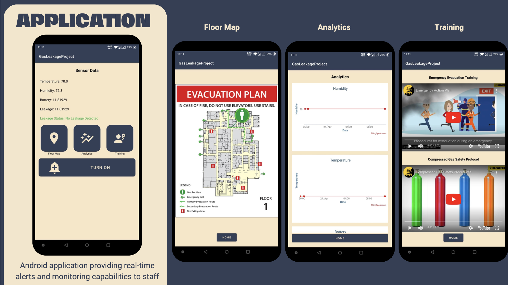
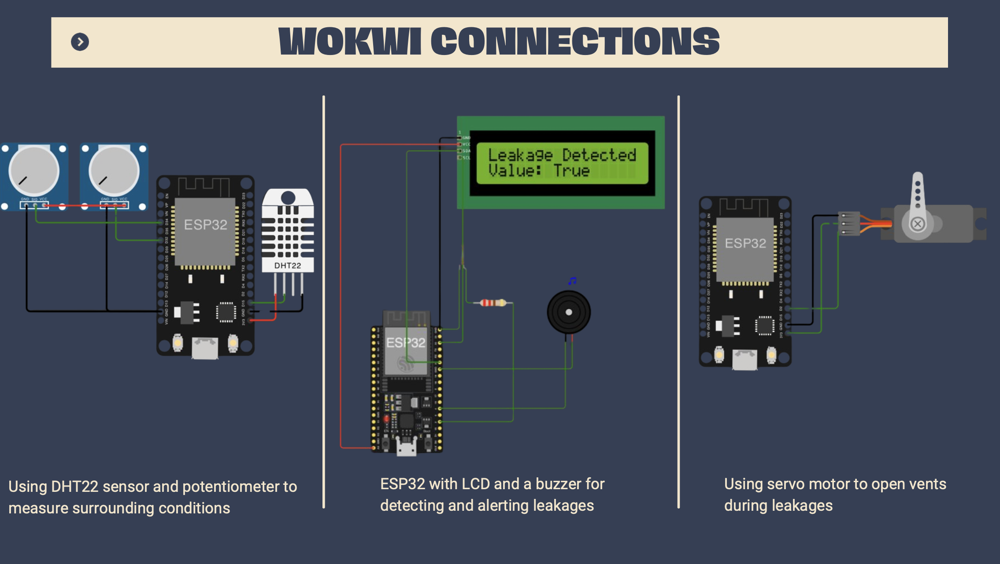

# Advanced Gas Pipeline Leakage Detection for Healthcare Facilities

## Abstract
This study introduces a revolutionary Internet of Things (IoT)-based gas leak detection system designed specifically for healthcare facilities. It combines cloud analytics, sensor technologies, and a user-centric warning system to enhance safety protocols. The system includes real-time gas level monitoring using sensor equipment and IoT technologies, with an Android app delivering instant notifications and monitoring capabilities. The core technology is an ESP32 microcontroller interfaced with an LCD and a buzzer for immediate alerts, complemented by a DHT22 sensor and a potentiometer to adjust for environmental variations, thus enhancing detection accuracy and reducing false positives.

## Introduction
The project focuses on developing an advanced gas leak detection system that integrates precise sensors and IoT capabilities to quickly identify harmful gas concentrations in real-time. This proactive approach aims to minimize the potential for catastrophic events, providing a modern solution to healthcare safety.

## System Description
- **Sensor Technologies**: Utilizes a variety of sensors to monitor gas levels and environmental conditions continuously. This includes DHT22 sensors for temperature and humidity, and potentiometers to adjust detection thresholds based on environmental factors.
- **Hardware Setup**: Built around the ESP32 microcontroller, which handles data collection, processing, and transmission. It integrates a buzzer for audible alerts and an LCD for real-time data display.
- **Data Handling**: Employs ThingSpeak for cloud-based data storage and analysis, enabling real-time visualization and trend analysis.
- **Android Application**: Serves as the interface for receiving alerts and monitoring system status, ensuring that healthcare staff are promptly informed about potential leaks.
- **Ventilation Control**: Includes a servo motor to automate ventilation operations, enhancing safety by actively managing air quality in response to detected leaks.
 

## Resources
- **Android App Code**: [Link to repository]( https://github.com/shaunak-deo/GasLeakageProject.git)
- **Wokwi Project Links**:
  - Sensor Module: [View Project](https://wokwi.com/projects/394893349637649409)
  - Alarm System: [View Project]( https://wokwi.com/projects/395893914190560257)
  - Servo Motor Control: [View Project](https://wokwi.com/projects/396003136871830529)
- **ThingSpeak Channel**: [View Data](https://thingspeak.com/channels/2504476)

## Results and Discussion
The system has been rigorously tested in simulated environments and real-world scenarios, demonstrating high reliability and effectiveness. It supports healthcare facilities in maintaining a safe environment by providing timely alerts and actionable insights.

## Conclusion
This IoT-based gas leak detection system represents a significant advancement in healthcare safety, combining cutting-edge sensor technology, IoT integration, and user-focused design. Future developments will focus on predictive analytics for preemptive leak detection and enhancements to the user interface tailored to specific roles within healthcare facilities.

This documentation outlines the high-level details of the Advanced Gas Pipeline Leakage Detection system, designed to enhance the operational safety of healthcare facilities through innovative technology. For detailed implementation and further inquiries, refer to the provided resource links.
